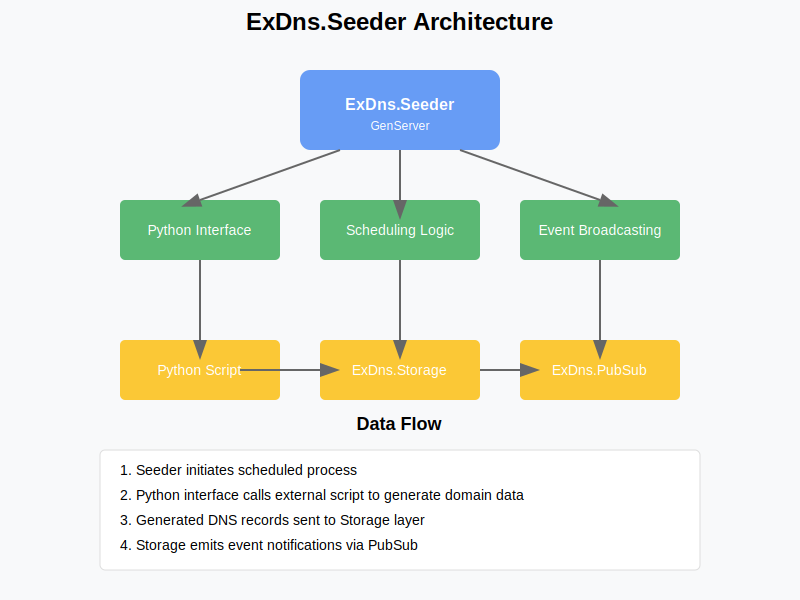

# Seeder

**TODO: Add description**

## Installation

If [available in Hex](https://hex.pm/docs/publish), the package can be installed
by adding `seeder` to your list of dependencies in `mix.exs`:

```elixir
def deps do
  [
    {:seeder, "~> 0.1.0"}
  ]
end
```

Documentation can be generated with [ExDoc](https://github.com/elixir-lang/ex_doc)
and published on [HexDocs](https://hexdocs.pm). Once published, the docs can
be found at <https://hexdocs.pm/seeder>.


# ExDns.Seeder: Detailed Implementation Plan

---

## Component Overview

**ExDns.Seeder** is responsible for generating and seeding DNS records from external sources into your system. It serves as the entry point for all DNS data and ensures the system has fresh and relevant data for resolution.

---



---
## Architecture Components

1. **Main GenServer**
    - Core process for managing the seeding lifecycle
    - Maintains state for seeding operations
    - Handles scheduling and coordination

2. **Python Interface**
    - ErlPort integration for Python communication
    - Data transformation between Elixir and Python
    - Error handling for external process failures

3. **Scheduling Logic**
    - Timer-based scheduling for periodic seeding
    - Configurable intervals and batch sizes
    - Throttling mechanisms for resource management

4. **Event Broadcasting**
    - PubSub integration for system notifications
    - Event normalization and formatting
    - Subscriber management

---

## Data Flow Sequence

### 1. Initialization Flow
- `ExDns.Seeder` GenServer starts during application boot
- Establishes connection to Python runtime via ErlPort
- Loads configuration parameters (intervals, domains, etc.)
- Schedules first seeding operation

### 2. Regular Seeding Flow
- Timer triggers scheduled seeding operation
- Seeder prepares parameters for Python script
- Python script generates DNS records based on parameters
- Records returned to Elixir process
- Validation and normalization of returned data
- Bulk insertion into `ExDns.Storage`
- Event broadcast notifying system of new records
- Next seeding operation scheduled

### 3. Event Publication Flow
- Seeding completion generates events
- Events published to PubSub system
- Subscribers (like caches, resolvers) react to new data
- Metrics collected for seeding operations

---

## Data Schemas

### Seeder Configuration Schema

```elixir
%{
  interval: 1_800_000,  # 30 minutes in milliseconds
  batch_size: 100,
  domains: ["com", "org", "net", "io", "tech"],
  python_path: "/path/to/python_scripts",
  seed_types: ["A", "AAAA", "MX", "CNAME", "TXT"],
  ttl_range: {300, 86400}  # min/max TTL in seconds
}
```

### Python Script Input Format

```elixir
%{
  domains: ["com", "org", "net", "io", "tech"],
  count: 100,
  types: ["A", "AAAA", "MX", "CNAME", "TXT"],
  ttl_range: {300, 86400},
  timestamp: 1618572800
}
```

### Python Script Output Format

```elixir
[
  %{
    domain: "example.com",
    type: "A",
    ttl: 3600,
    value: "192.168.1.1"
  },
  %{
    domain: "mail.example.org",
    type: "MX",
    ttl: 7200,
    priority: 10,
    value: "mailserver.example.org"
  }
  # More records...
]
```

### Seeding Event Schema

```elixir
%{
  event: :dns_records_seeded,
  count: 100,
  domains: ["com", "org", "net", "io", "tech"],
  timestamp: 1618572800,
  duration_ms: 1250
}
```

---

## Implementation Steps

### Phase 1: Basic Structure (Week 1)

1. **Create the GenServer scaffold**
    - Define state structure
    - Implement `init/1` callback
    - Add basic `handle_*` callbacks

2. **Set up ErlPort connection**
    - Add `erlport` dependency
    - Create Python runtime initialization
    - Add error handling for Python failures

3. **Create basic Python script**
    - Implement simple record generation
    - Define data exchange format
    - Add error handling and logging

---

### Phase 2: Core Functionality (Week 1–2)

1. **Implement scheduling logic**
    - Add timer-based scheduling
    - Create configurable intervals
    - Implement `schedule_next_seed` function

2. **Create DNS record generation**
    - Build domain name generation logic
    - Implement different record type generators
    - Add randomization for realistic data

3. **Add storage integration**
    - Implement batch inserts to database
    - Add transaction support
    - Implement error handling and retries

---

### Phase 3: Advanced Features (Week 2)

1. **Add event broadcasting**
    - Integrate with `Phoenix.PubSub`
    - Define event schemas
    - Implement broadcast functionality

2. **Implement rate limiting**
    - Add throttling mechanisms
    - Implement adaptive scheduling
    - Create backpressure handling

3. **Add monitoring and metrics**
    - Implement `telemetry` integration
    - Add performance metrics
    - Create health check functionality

---

### Phase 4: Refinement (Week 3)

1. **Optimize Python integration**
    - Improve data serialization
    - Add connection pooling
    - Implement timeout handling

2. **Add configuration management**
    - Create runtime configuration updates
    - Implement domain filtering
    - Add prioritization logic

3. **Create testing framework**
    - Implement unit tests
    - Add integration tests
    - Create property-based tests

---

## Learning Outcomes

- **ErlPort**: Integrating Elixir with Python for DNS record generation  
- **GenServer**: Managing state and lifecycle with OTP's GenServer  
- **Timer-based scheduling**: Implementing periodic tasks in Elixir  
- **Phoenix.PubSub**: Broadcasting events across the system  
- **Database interaction**: Bulk operations with Ecto  
- **Transaction management**: Ensuring data consistency  
- **Error handling**: Creating resilient systems  
- **Telemetry**: Monitoring and metrics collection  

---

## Integration Points

- `ExDns.Storage`: For persisting generated DNS records  
- `ExDns.PubSub`: For broadcasting seeding events  
- `ExDns.Supervisor`: For proper process supervision  
- `ExDns.Metrics`: For collecting performance metrics  

---

## Challenges and Solutions

1. **Challenge**: Python process crashes during seeding  
   **Solution**: Implement supervision strategy and automatic restart

2. **Challenge**: Database bottlenecks during bulk inserts  
   **Solution**: Implement batching, connection pooling, and transaction management

3. **Challenge**: Memory usage spikes with large record sets  
   **Solution**: Implement streaming processing and chunked operations

4. **Challenge**: System overload from frequent seeding  
   **Solution**: Add adaptive scheduling and backpressure mechanisms